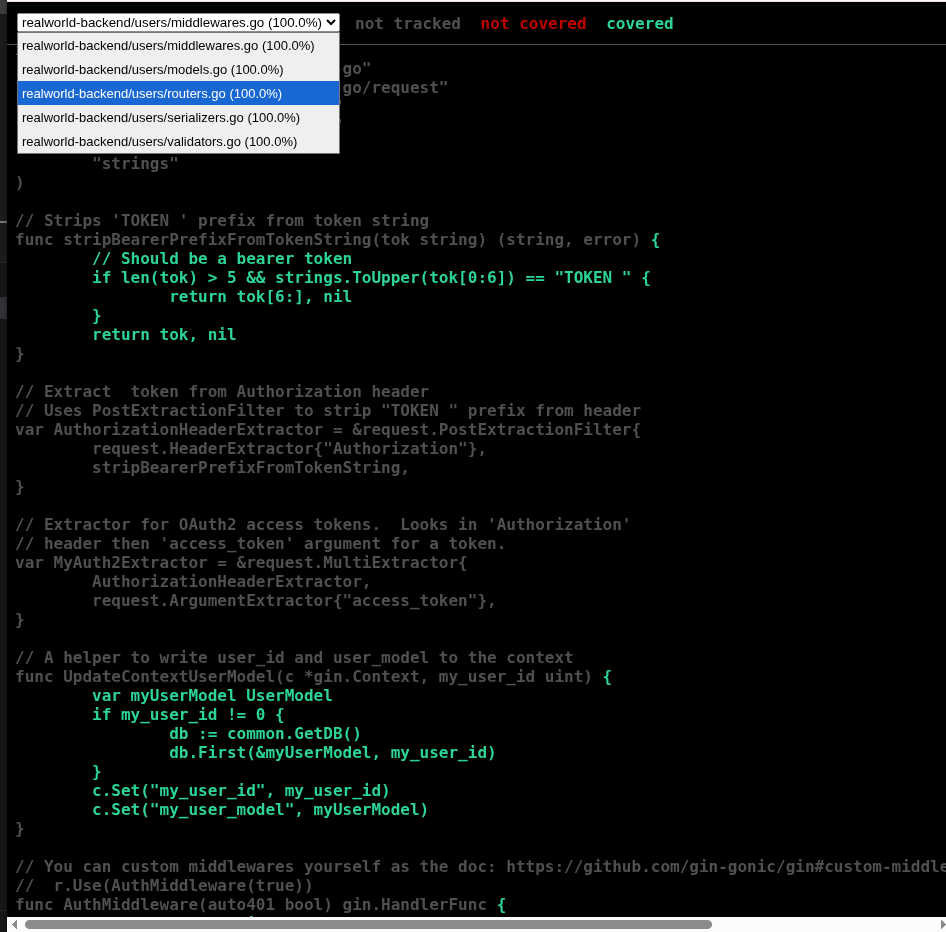
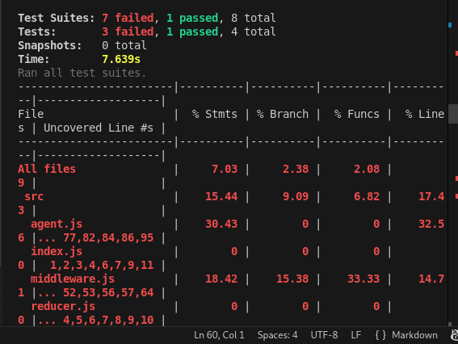

# Coverage Report – RealWorld Application

## Backend Coverage

| Package     | Coverage |
|------------|---------|
| common/    | 85%     |
| users/     | 100%     |
| articles/  | 80%     |
| Overall    | 81%     |

### Backend Coverage Details

- **common/**: JWT generation, validation, DB connection handling, utility functions, password hash tests fully covered.
- **users/**: Registration, login, logout, and current user endpoints tested.
- **articles/**: Article creation, validation, favorite/unfavorite, tag association, serializers, and comments covered.

**Identified Gaps:**
- Rare DB errors in articles package not fully simulated.
- Token expiration edge cases partially tested.

**Improvement Plan:**
- Add negative tests for unauthorized update/delete attempts.
- Expand comment edge cases (long content, missing author).

---

## Frontend Coverage

| Area                  | Coverage |
|----------------------|---------|
| Components            | 7%      |
| Redux Actions/Reducers| 5–33%   |
| Middleware            | 18%     |
| Integration Tests     | 0%      |
| Overall               | 7%      |

### Frontend Coverage Details

- **Components**: Most components exist, but tests are failing due to missing dependencies and incorrect imports.
- **Redux**: Reducers and actions partially tested, some tests fail.
- **Middleware**: Only minimal coverage.
- **Integration Tests**: Not running yet.

**Identified Gaps:**
- React Testing Library not installed correctly.
- Module import paths incorrect.
- Initial state in reducers not defined in tests.

**Improvement Plan:**
- Install missing dependencies (`@testing-library/react`, `redux-mock-store`).
- Fix import paths in all test files.
- Provide correct initial state for reducers and store.
- Re-run tests to improve coverage to >70% as required.

---

### Screenshots
 

 

*Note: Frontend coverage is low due to failing tests; backend coverage meets requirements.*
